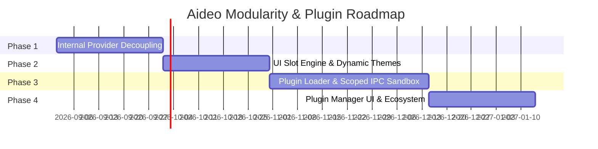

# Aideo Music Player — Modular & Plugin Architecture Roadmap

This document outlines the architectural blueprint, design specifications, security model, and phased roadmap for transforming Aideo Music Player into a customizable, modular, and plugin-capable desktop music player.

---

## 1. Vision & Architecture Overview

Aideo's modular plugin architecture decouples core playback and DSP services from third-party integrations, UI themes, metadata providers, and visualizers.

```mermaid
graph TD
    subgraph Core Desktop App (Tauri v2 + React 19 + Rust)
        PRegistry[Plugin Manager & Registry]
        SlotEngine[UI Slot & Layout Engine]
        EventBus[Player & Audio Event Bus]
        TauriBridge[Permission-Gated API Bridge]
    end

    subgraph Extensibility Layers
        T[Theme & Style Packs]
        FP[Frontend UI Extensions]
        BP[Wasm / Script Providers]
    end

    T -->|CSS Variables & Token Presets| SlotEngine
    FP -->|Custom Views, Visualizers, Controls| SlotEngine
    FP -->|Events & Scoped Actions| TauriBridge
    BP -->|Lyrics, Scrobblers, Source Resolvers, DSP| TauriBridge
    TauriBridge --> EventBus
    PRegistry --> SlotEngine
```

---

## 2. Core Extensibility Pillars

### Pillar 1: UI & Theme Customization System
* **Design Token Engine**: Define styling (colors, glassmorphism blur, borders, visualizer palettes, font families) via JSON theme packs mapped to dynamic CSS variables.
* **Dynamic Layout Slots**: Convert fixed UI surfaces into dynamic **Slot Containers**:
  * `SidebarSlot`: Dynamic navigation items and custom route tabs.
  * `PlayerBarSlot`: Custom playback controls, status badges, and action buttons.
  * `NowPlayingSlot`: Custom panels (lyrics, chords, artist info, visualizers).
* **Workspace Configurator**: Allow users to toggle, reorder, or pin views in Settings.

### Pillar 2: Frontend UI & Visualizer Extensions
* **Custom Route Views**: Micro-views rendered inside the main content area (e.g., custom playlist organizers, charts, external integrations).
* **Audio Visualizers**: Canvas, WebGL, or WebGPU shaders registered to an audio frequency buffer stream (`frequencyData`, `timeDomainData`, `bpm`, `key`).
* **Interactive Panels**: Popout lyrics, floating mini-player overlays, or metadata drawers.

### Pillar 3: Provider Engine (Data, Sources & DSP)
Abstract hardcoded monolithic integrations into standardized provider interfaces:
* **Lyric Providers**: Fetch plain and synchronized LRC lyrics from multiple fallback providers.
* **Scrobbler Providers**: Scrobble events (`onTrackStart`, `onProgress`, `onTrackEnd`) to services like Last.fm, ListenBrainz, Maloja, or custom webhooks.
* **Metadata & Artwork Providers**: Resolve artist bios, high-res covers, discography data, and genre tags.
* **Audio Stream & Source Resolvers**: Resolve tracks from remote or local storage vaults (e.g., Subsonic, Jellyfin, WebDAV, Bandcamp).
* **DSP Audio Effects**: Custom EQ curves, spatializers, and audio filters (WASM-based).

---

## 3. Plugin Specification (`plugin.json`)

Every plugin lives in the user plugin directory (`%APPDATA%/aideo/plugins/<plugin-id>/` on Windows, `~/.config/aideo/plugins/<plugin-id>/` on Linux/macOS):

```json
{
  "$schema": "https://aideo.app/schemas/plugin.v1.json",
  "id": "com.community.genius-lyrics",
  "name": "Genius Lyrics Provider",
  "version": "1.0.0",
  "author": "Community Contributor",
  "description": "Fetches rich synchronized and plain lyrics from Genius.",
  "target": "frontend",
  "entry": "dist/index.js",
  "permissions": [
    "network:fetch",
    "player:read_track"
  ],
  "contributions": {
    "lyrics_provider": {
      "id": "genius",
      "displayName": "Genius",
      "priority": 10
    },
    "settings_panel": "dist/settings.js"
  }
}
```

---

## 4. Security & IPC Sandbox Model

> [!CAUTION]
> **Tauri IPC Isolation Rule**: Third-party plugins must NEVER have direct access to raw Tauri `invoke()` commands to prevent unauthorized filesystem, shell, or network execution.

### Scoped `window.AideoAPI` Bridge
Plugins interact exclusively through a strictly permission-gated bridge:

| Namespace | Capabilities Provided |
| :--- | :--- |
| `AideoAPI.player` | Subscribe to playback events (`trackChange`, `stateChange`, `timeUpdate`), read current track metadata. |
| `AideoAPI.lyrics` | Register lyric providers: `registerProvider({ getLyrics: (track) => ... })`. |
| `AideoAPI.scrobbler` | Register scrobble listeners: `registerScrobbler({ onTrackStart, onTrackEnd })`. |
| `AideoAPI.visualizer` | Register visualizer shaders receiving real-time FFT frequency streams. |
| `AideoAPI.ui` | Register custom sidebar items, modals, drawer panels, and toast messages. |
| `AideoAPI.storage` | Sandboxed key-value store namespaced per plugin ID. |
| `AideoAPI.http` | Origin-restricted and rate-limited HTTP fetcher. |

### Execution Environment
* **Frontend UI Plugins**: Isolated execution via Sandboxed IFrames or Web Workers using message-passing RPC to the React host.
* **Data & DSP Plugins**: Rust-managed WebAssembly engine (**Extism** / **Wasmtime**) for safe, high-performance sandbox execution without recompiling the player.

---

## 5. Phased Implementation Roadmap



### Phase 1: Internal Decoupling & Provider Interfaces
- [ ] Refactor built-in services (Last.fm, ListenBrainz, Lyrics, Tidal, Qobuz) to implement internal `IProvider`, `IScrobbler`, and `ISourceResolver` interfaces.
- [ ] Centralize audio and playback state change dispatches through a unified internal Event Bus.
- [ ] Ensure all existing unit and integration tests pass without regression.

### Phase 2: UI Slot Engine & Theming System
- [ ] Implement `<SlotContainer slot="..." />` React components for Sidebar, PlayerBar, and NowPlaying panels.
- [ ] Convert hardcoded sidebar routes into a dynamic registry that supports user reordering and visibility toggling.
- [ ] Implement dynamic theme loader supporting JSON theme packs with live CSS variable updates.

### Phase 3: Plugin Loader & IPC Security Sandbox
- [ ] Implement Rust-side filesystem scanner for `%APPDATA%/aideo/plugins/` to parse and validate `plugin.json` manifests.
- [ ] Build the permission validator and inject the scoped `window.AideoAPI` bridge into plugin execution contexts.
- [ ] Support WebAssembly (Wasm) runtime integration in Rust for high-throughput metadata and DSP extensions.

### Phase 4: In-App Plugin Manager & Developer Tooling
- [ ] Create a dedicated **Plugins & Themes** management tab inside Settings to enable/disable, configure, and inspect plugin permissions.
- [ ] Implement hot-reload support for local plugin development.
- [ ] Publish `@aideo/plugin-sdk` type definitions and starter templates for community developers.

---

## 6. Windows Platform & Audio Gold Standards

Aideo aims to be the reference desktop player on Windows, combining the audiophile pedigree of **foobar2000** and the library capabilities of **MusicBee** with a modern Fluent desktop architecture.

### Current Implementation Status
* [x] **Bit-Perfect WASAPI Audio Engine**: Custom low-latency WASAPI Exclusive & Shared output with auto-sample rate negotiation and hardware lock release on pause (`src-tauri/src/wasapi_engine.rs`).
* [x] **Advanced DSP Pipeline**: Multi-band parametric EQ, EBU R128 loudness normalization, Bauer stereo-to-binaural crossfeed, and high-quality resampling (`src-tauri/src/player/dsp.rs`).
* [x] **High-Performance Library**: Local SQLite database with parallel multithreaded tag indexing and filesystem change watcher (`src-tauri/src/db.rs`, `src-tauri/src/scanner.rs`).
* [x] **Taskbar Thumbnail Toolbar**: Native Win32 `ITaskbarList3` playback controls (Play/Pause, Prev, Next) on taskbar icon hover (`src-tauri/src/taskbar.rs`).
* [x] **Floating Desktop Lyrics**: Transparent, click-through lockable floating desktop lyrics overlay (`src-tauri/src/lyrics.rs`).
* [x] **Global Hotkeys**: Background media hotkey listener (`src-tauri/src/hotkeys.rs`).

### Planned Upgrades
- [ ] **Native Windows SMTC (System Media Transport Controls)**: Full integration with Windows volume HUD overlay, lock screen controls, and Action Center / Notification flyout media widget via Windows Media APIs or `navigator.mediaSession`.
- [ ] **ASIO Audio Output Engine**: Optional direct ASIO driver support alongside WASAPI Exclusive for professional USB DACs and studio audio interfaces.
- [ ] **Windows 11 Fluent Material Backdrops**: Support native Windows Mica / Acrylic window backdrops and theme matching.

