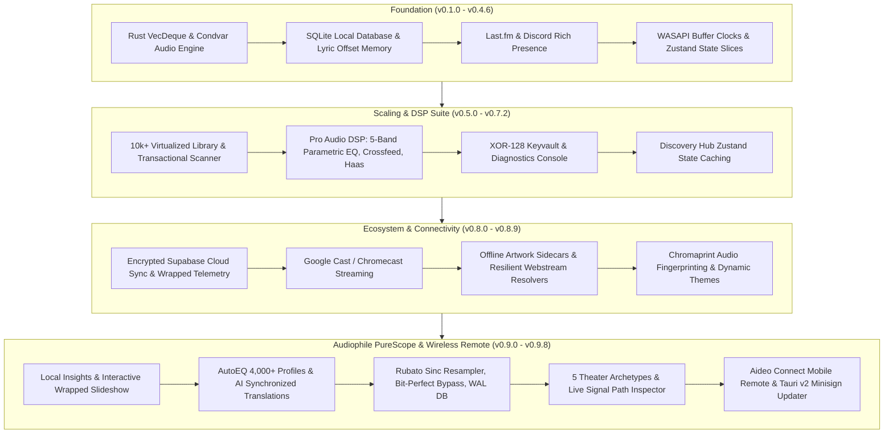

# 💎 Aideo Music Player — Complete Version History & Release Dossier

> **Comprehensive release archive and technical evolution log of Aideo Music Player across all GitHub releases.**
> Documents every milestone, audio DSP pipeline evolution, user interface iteration, cloud/streaming integration, bug fix, and architectural hardening from `v0.1.0` through `v0.9.8` and current development `HEAD`.

---

## 📑 Table of Contents

- [💎 Aideo Music Player — Complete Version History \& Release Dossier](#-aideo-music-player--complete-version-history--release-dossier)
  - [📑 Table of Contents](#-table-of-contents)
  - [📊 Quick Release Index \& Evolution Matrix](#-quick-release-index--evolution-matrix)
  - [🚀 Version-by-Version Detailed Breakdown](#-version-by-version-detailed-breakdown)
    - [💎 v0.9.9 — Reliable Unified Music Sources, Direct Webstream Audio & Motion Canvas](#-v099--reliable-unified-music-sources-direct-webstream-audio--motion-canvas)
    - [💎 v0.9.8 — Aideo Connect Mobile Remote, Official Tauri v2 Updater \& Next-Gen Discovery Hubs](#-v098--aideo-connect-mobile-remote-official-tauri-v2-updater--next-gen-discovery-hubs)
    - [💎 v0.9.7 — Theater Archetypes, Audiophile Signal Path \& Visualizer Overhaul](#-v097--theater-archetypes-audiophile-signal-path--visualizer-overhaul)
    - [🔧 ffmpeg-audio-dsd — FFmpeg Audio Transcoder with DSD (n8.0.1)](#-ffmpeg-audio-dsd--ffmpeg-audio-transcoder-with-dsd-n801)
    - [💎 v0.9.6 — Audiophile Engine, Studio DSP \& Customization Release](#-v096--audiophile-engine-studio-dsp--customization-release)
    - [💎 v0.9.5 — The Discovery \& Performance Overhaul](#-v095--the-discovery--performance-overhaul)
    - [💎 v0.9.4 — Real-Time Signal Path, Lossless Bit-Perfect Bypass \& Sinc Resampling](#-v094--real-time-signal-path-lossless-bit-perfect-bypass--sinc-resampling)
    - [💎 v0.9.3 — Headphone Calibration, Lyric Translations \& Pre-DSP Visualizers](#-v093--headphone-calibration-lyric-translations--pre-dsp-visualizers)
    - [💎 v0.9.2 — Clean Library, Artist Hub, Glass UI \& Vibe-Locked Radio](#-v092--clean-library-artist-hub-glass-ui--vibe-locked-radio)
    - [💎 v0.9.1 — Local Listening Insights, Aideo Wrapped Slideshow \& Light Mode Polish](#-v091--local-listening-insights-aideo-wrapped-slideshow--light-mode-polish)
    - [💎 v0.9.0 — Web Stream Songs Filter, Metadata Preservation \& Latency Boost](#-v090--web-stream-songs-filter-metadata-preservation--latency-boost)
    - [💎 v0.8.9 — Randomized Mixes, Connect \& Cast Hub, Now Playing Overhaul](#-v089--randomized-mixes-connect--cast-hub-now-playing-overhaul)
    - [💎 v0.8.7 — Web Stream HLS Whitelist, CORS Dynamic Themes \& Transition Sync](#-v087--web-stream-hls-whitelist-cors-dynamic-themes--transition-sync)
    - [💎 v0.8.6 — Webstream InnerTube Caching \& Chromecast Connection Pooling](#-v086--webstream-innertube-caching--chromecast-connection-pooling)
    - [💎 v0.8.5 — Robust Webstream Resolution \& Queue Error Self-Healing](#-v085--robust-webstream-resolution--queue-error-self-healing)
    - [💎 v0.8.4 — Offline Cover Art Caching \& Startup Session Persistence](#-v084--offline-cover-art-caching--startup-session-persistence)
    - [💎 v0.8.3 — Google Cast Integration \& Seamless Playback Handover](#-v083--google-cast-integration--seamless-playback-handover)
    - [💎 v0.8.1 — Atlas OS Portability \& Critical Windows Fallbacks](#-v081--atlas-os-portability--critical-windows-fallbacks)
    - [💎 v0.8.0 — Supabase Cloud Sync \& Wrapped Play Logging](#-v080--supabase-cloud-sync--wrapped-play-logging)
    - [💎 v0.7.2 — Discovery Hub Zustand Caching \& Global Charts Duration Resolving](#-v072--discovery-hub-zustand-caching--global-charts-duration-resolving)
    - [💎 v0.7.1 — Performance Tuning, Double-Buffering \& DSD HUD Metrics](#-v071--performance-tuning-double-buffering--dsd-hud-metrics)
    - [💎 v0.7.0 — Advanced Artwork Manager, Diagnostics Console \& XOR Keyvault](#-v070--advanced-artwork-manager-diagnostics-console--xor-keyvault)
    - [💎 v0.6.0 — The Pro Audio DSP Suite \& Webstream Discovery Hub](#-v060--the-pro-audio-dsp-suite--webstream-discovery-hub)
    - [💎 v0.5.1 — Playback Synchronization \& Timer Jitter Patch](#-v051--playback-synchronization--timer-jitter-patch)
    - [💎 v0.5.0 — The Performance \& Stability Update (10k+ Track Scaling)](#-v050--the-performance--stability-update-10k-track-scaling)
    - [💎 v0.4.6 — WASAPI Buffer Clock Alignment \& Stream URL Parsers](#-v046--wasapi-buffer-clock-alignment--stream-url-parsers)
    - [💎 v0.4.5 — The Presence Update (Discord Rich Presence \& MusicBrainz)](#-v045--the-presence-update-discord-rich-presence--musicbrainz)
    - [💎 v0.4.0 — The Audiophile Evolution (Lazy-Loading RAM \& Studio DSP)](#-v040--the-audiophile-evolution-lazy-loading-ram--studio-dsp)
    - [💎 v0.3.0 — The Interactive Era (Manual Lyric Search \& Path Caching)](#-v030--the-interactive-era-manual-lyric-search--path-caching)
    - [💎 v0.2.2 — The Last.fm Update \& Scrobbler Integration](#-v022--the-lastfm-update--scrobbler-integration)
    - [💎 v0.2.0 — The Studio \& Sync Update (Lyric Offset Memory \& Auto-Updater)](#-v020--the-studio--sync-update-lyric-offset-memory--auto-updater)
    - [💎 v0.1.0 — Initial Audio Engine Release (Rust Core, 10-Band EQ, Romaji)](#-v010--initial-audio-engine-release-rust-core-10-band-eq-romaji)
    - [🔮 Post-v0.9.8 Ongoing Development (HEAD — September 2026)](#-post-v098-ongoing-development-head--september-2026)
  - [🏛️ Architectural Evolution Summary](#️-architectural-evolution-summary)

---

## 📊 Quick Release Index & Evolution Matrix

| Version | Release Date | Codename / Focus | Primary Capabilities Added |
|:---|:---:|:---|:---|
| **v0.9.9** | 2026-09-18 | Reliable Unified Sources & Motion Canvas | Reliable Unified Music Sources architecture with conservative recording identity, direct Webstream Opus audio pipeline, Motion Canvas video artwork loops, 6 signature home screen layouts, interactive Source Switcher, Settings overhaul, GPL-3.0 licensing, 1,107 frontend + 315 backend tests. |
| **v0.9.8** | 2026-09-07 | Aideo Connect & Tauri v2 Updater | Mobile web LAN remote control, Minisign cryptographically verified in-app updater, Next-gen Discovery Hubs (Editorial, Stage), 5-mode visualizer physics. |
| **v0.9.7** | 2026-09-05 | Theater Archetypes & Signal Path | 5 Theater Archetypes (Hi-Fi Deck, Vinyl Turntable, Stage, Swiss Poster, Zen), Live Signal Path Inspector HUD, PureScope visualizer overhaul, true gapless stream pipeline, EcoQoS opt-out. |
| **ffmpeg-audio-dsd** | 2026-08-24 | DSD Native Transcoder Plugin | Custom n8.0.1 audio-only FFmpeg build with DSF/DFF demuxers and DSD/DST decoders for native DSD playback. |
| **v0.9.6** | 2026-08-23 | Audiophile Engine & Studio DSP | Bit-perfect DAC handshake, Lofty metadata tag editor, DLNA/UPnP Hi-Fi streaming, EBU R128 silence gating, Rubato sinc resampler micro-click elimination. |
| **v0.9.5** | 2026-08-13 | Discovery Overhaul & Slop Filter | Multi-tier recommendation pipeline, anti-collision title verification, pure-music slop filter (bans reactions/tutorials), 0% idle CPU sleep architecture, pinned Mini Player. |
| **v0.9.4** | 2026-08-12 | Real-Time Signal Path & WAL DB | Live audio stream topology graph, lossless bit-perfect bypass, vacuum tube warmth simulation, Hann FFT cache, SQLite WAL mode indexing. |
| **v0.9.3** | 2026-07-23 | Auto-EQ & Synchronized Lyrics | 4,000+ AutoEQ headphone profiles, dynamic storage manager, 1-click synchronized AI lyric translation & Romaji, pre-DSP visualizer extraction. |
| **v0.9.2** | 2026-07-22 | Clean Library & Artist Hub | Interactive Artist Drawer, dynamic album color tinting, glass search pills, vibe-locked radio autoplay, zero-telemetry local scrobbler recommendation engine. |
| **v0.9.1** | 2026-07-18 | Aideo Insights & Wrapped | Completely local listening analytics dashboard (heatmaps, skip rates, peak hours), interactive Aideo Wrapped slideshow with personality badges, light mode contrast fixes. |
| **v0.9.0** | 2026-07-01 | Stream Optimization & Recovery | Webstream title parser recovery, app restart metadata persistence, concurrent discovery fetch optimization (34 → 13 queries, 2.5x speedup). |
| **v0.8.9** | 2026-06-30 | Randomized Mixes & Unified Cast | Pool-wide artist randomization, unified Connect & Cast popover, Chromaprint audio fingerprinting FFI, multi-row Now Playing title header layout. |
| **v0.8.7** | 2026-06-21 | Stream Whitelisting & CORS | FFmpeg HLS protocol whitelisting, anonymous canvas CORS for album art color extraction, race-condition guard for async lyric updates. |
| **v0.8.6** | 2026-06-21 | InnerTube Caching & Connection Pool | Thread-safe InnerTube API key cache, crate-wide HTTP connection pooling for Subsonic/Jellyfin/Webstream, database artwork overwrite prevention. |
| **v0.8.5** | 2026-06-18 | Resilient Webstream Engine | Automated yt-dlp fallback updates, mweb/android client rotation to bypass HTTP 403/429, self-cleaning playback queue on unplayable tracks. |
| **v0.8.4** | 2026-06-18 | Offline Cover Art & Session Save | Local cover art sidecar caching (`{stem}.jpg`), CORS-immune fallback rendering, auto-restoring credentials and cloud sessions at launch. |
| **v0.8.3** | 2026-06-08 | Google Cast / Chromecast | Native Chromecast audio casting, bidirectional playback handover with sub-second position retention, live seekbar synchronization. |
| **v0.8.1** | 2026-06-05 | Atlas OS & Stripped Windows | Portability fixes for stripped Windows OS (Atlas OS, Tiny10), fallback to native `tar.exe` without PowerShell, clean `%TEMP%` path isolation. |
| **v0.8.0** | 2026-06-04 | Supabase Cloud Sync & Wrapped Log | Bidirectional encrypted Supabase cloud backup/restore, background play telemetry logging, 1-click Google/GitHub OAuth, native OS borderless fullscreen. |
| **v0.7.2** | 2026-06-03 | Discovery State Caching | Global Zustand discovery cache for instant tab transitions, background concurrent duration resolver for Webstream discovery charts, WASAPI sample clamping. |
| **v0.7.1** | 2026-05-30 | Performance & Telemetry Tuning | Offscreen canvas double-buffering for spectrograms, 60 FPS web visuals, credential leak prevention, DSD/Upsampler format badge computation. |
| **v0.7.0** | 2026-05-29 | Artwork Manager & Diagnostics | iTunes high-res artwork finder, per-track artwork naming strategy, consumer vs developer diagnostics console, XOR-128 credential keyvault, constraint-free playlists. |
| **v0.6.0** | 2026-05-21 | Pro Audio DSP & Webstream Hub | 5-band parametric EQ, Linkwitz crossfeed, Haas spatializer, 20Hz Butterworth subsonic filter, EBU R128 normalizer, Tokio parallel Webstream scraper, skip debouncer. |
| **v0.5.1** | 2026-05-19 | Sync Hotfix & Timer Polish | Audio timer jitter fix (flushing hardware delay buffer during seeks), track-progression lyric freeze patch, anti-bounce skipping filter tuning. |
| **v0.5.0** | 2026-05-19 | Massive Scale Optimization | SQLite transactional scanner (100x import speedup for 10k+ libraries), virtualized React track list (`content-visibility`), panic-free WASAPI fallback on DAC unplug. |
| **v0.4.6** | 2026-05-17 | WASAPI Clocks & M3U/PLS Streams | Jitter-free WASAPI buffer clocks, external DAC handshake alignment (FiiO KA5), dynamic PLS/M3U live internet radio stream parsing, Zustand state slice modularization. |
| **v0.4.5** | 2026-05-14 | Presence & MusicBrainz | Discord Rich Presence integration with profile status buttons, MusicBrainz AI "Magic Match" metadata resolver, Last.fm "Pure List" dashboard, strict TypeScript types. |
| **v0.4.0** | 2026-05-13 | Audiophile Evolution & RAM Cache | Lazy-loading RAM audio cache, 10-band graphic EQ with dynamic soft limiter, sub-millisecond buffer-aware lyric synchronization, dynamic format status badges. |
| **v0.3.0** | 2026-05-12 | Interactive Lyrics & Zero Lag | Manual lyric search modal (LRCLIB, NetEase, QQMusic), FFmpeg path caching for instant playback, total UI state flushing on stop, desktop-spec API header spoofing. |
| **v0.2.2** | 2026-05-12 | Last.fm Scrobbler Integration | Official Last.fm scrobbling integration, configurable scrobble time/percentage thresholds, build-time `.env` secrets injection, Tauri 2 IPC bridge tuning. |
| **v0.2.0** | 2026-05-11 | Studio & Sync Update | Persistent manual lyric sync offset memory saved in SQLite, Lyric Studio AI editor workspace, Gold lossless audio tags (FLAC, WAV), global keyboard shortcuts. |
| **v0.1.0** | 2026-05-11 | Initial Audio Engine Release | Initial public release: Rust audio engine with `VecDeque` and `Condvar`, 0% idle CPU, gapless track transitions, NetEase/QQ lyric scraping, Romaji transliteration, 10-band studio EQ. |

---

## 🚀 Version-by-Version Detailed Breakdown

---

### 💎 v0.9.8 — Aideo Connect Mobile Remote, Official Tauri v2 Updater & Next-Gen Discovery Hubs
- **Tag:** `v0.9.8`
- **Release Date:** 2026-09-07
- **Full Title:** *💎 Aideo Music Player v0.9.8 — Aideo Connect Mobile Remote, Official Tauri v2 Updater & Next-Gen Discovery Hubs*
- **Primary Goals:** Wireless smartphone remote control over local Wi-Fi, cryptographically verified desktop auto-updating via Tauri v2, discovery home screen redesigns, and visualizer ballistics tuning.

#### 🌟 Key Additions & Features
1. **Aideo Connect Mobile Remote & QR Pairing:**
   - **Zero-App Smartphone Control:** Control playback, adjust master volume, scrub through tracks, toggle shuffle/repeat, and view synchronized lyrics from any iOS or Android browser on the local network.
   - **Instant QR Pairing & 6-Digit PIN:** Generates an on-screen QR code and PIN for instantaneous connection.
   - **Timing-Attack Security:** Implemented constant-time byte comparisons (`constant_time_eq`) in the Rust HTTP remote server to harden authentication against side-channel brute-force attacks.
   - **Multi-Interface LAN Resolver:** Multi-target outbound socket probing automatically resolves the machine's true Wi-Fi IPv4 address, eliminating localhost and virtual interface conflicts.
2. **Official Tauri v2 Cryptographic Auto-Updater:**
   - **Minisign Signature Verification:** Fully transitioned to `@tauri-apps/plugin-updater` with cryptographic Minisign public key verification against release manifests.
   - **In-App Progress Modal:** Displays real-time download speed, transferred bytes, and a 1-click "Restart and Install" action.
   - **Manual Status Card:** Located under Settings → App & Updates.
3. **Next-Gen Discovery Hubs (Aideo Home):**
   - **Editorial Home:** Swiss minimalist design with large editorial hero banners, dynamic bento grids, and high-contrast typography.
   - **Stage Home:** Immersive concert stage layout featuring reactive ambient lighting tied to the playing track.
   - **GPU Acceleration:** Optimized CSS backdrop transitions with hardware acceleration.
4. **Studio Audio Visualizer Overhaul:**
   - Added 5 physics modes: *Studio Peak-Decay Bars* (gravity-accelerated caps), *Bilateral Mirror Spectrum*, *Analog Oscilloscope Ribbon* (Bezier wave splines), *Radial Halo Orbit*, and *Phosphor LED Dot-Matrix*.
   - Expandable 64px / 140px height toggle and full settings tuning card (FPS caps, decay friction, smoothing).
5. **Tidal & Stream Hardening:**
   - Fixed stream boundary EOF bug where Tidal tracks would hang indefinitely at the end instead of progressing the queue.
   - Proactive token refresh engine ensuring unbroken playback during multi-hour listening sessions.

#### 🧪 Verification & Metrics
- **TypeScript Typecheck:** Passed (`tsc --noEmit`, 0 errors).
- **Frontend Unit Tests:** 583/583 tests passing across 90 test suites.
- **Backend Cargo Tests:** 269 passed, 1 ignored.

---

### 💎 v0.9.7 — Theater Archetypes, Audiophile Signal Path & Visualizer Overhaul
- **Tag:** `v0.9.7`
- **Release Date:** 2026-09-05
- **Full Title:** *💎 Aideo Music Player v0.9.7 — Theater Archetypes, Audiophile Signal Path & Visualizer Overhaul*
- **Primary Goals:** Introducing bespoke fullscreen Theater Mode Visual Archetypes, a live Audio Telemetry HUD, PureScope visualizer engine rewrite, true bit-perfect execution, and 60+ FPS karaoke lyric rendering.

#### 🌟 Key Additions & Features
1. **5 Bespoke Theater Mode Visual Archetypes:**
   - **Stage Mode:** Ambient light blooming, concert typography, and floating transport controls.
   - **Hi-Fi Studio Deck:** Skeuomorphic rack-mount faceplate with dual-needle ballistic VU meters (Peak + RMS response) and tactile switches.
   - **Vinyl Turntable:** Rotating 33⅓ RPM vinyl with groove reflections, dynamic tonearm movement tracking playback progress, needle drop/lift animations, and lyric ticker.
   - **Editorial Poster:** Magazine layout with dominant artwork color palette extraction and liner notes drawer.
   - **Zen Minimalist:** Distraction-free sanctuary with ambient breathing text and hover controls.
   - **Floating HUD & Up Next Queue Drawer:** Tailored glassmorphic floating transport bar and slide-out queue panel.
2. **Audio Telemetry & Live Signal Path Inspector:**
   - Interactive HUD modal displaying the full audio pipeline: Container format (e.g. FLAC 96kHz / 24-bit) → DSP Stage (EQ, Haas, Resampler) → Hardware Endpoint (WASAPI Exclusive, ASIO).
   - Real-time Bit-Perfect Verification Badge confirming whether audio is bit-perfect or processed.
3. **PureScope Visualizer Engine:**
   - 5 styles: Bars, Waveform, Frequency Bars, Circular Spectrum, Phosphor Scope.
   - Ballistic peak decay physics, zero-crossing waveform alignment, and idle breathing lines.
4. **Audiophile Audio Engine & DSP Hardening:**
   - **WASAPI Exclusive Buffer Drain Sync:** Verifies hardware buffer drainage to the exact final millisecond before triggering EOF progression.
   - **True Bit-Perfect Pipeline:** Strict bypass of EQ, limiter, volume, and dither when input matches output DAC parameters.
   - **True Gapless Stream Sessions:** Integrated encoder delay and padding trimming (`iTunSMPB` headers).
   - **Clock Smoothing:** Monotonic playback clock eliminates 1:53 stutters and jump-backs.
   - **Windows EcoQoS Opt-Out:** Audio threads register with Windows MMCSS (`THREAD_PRIORITY_TIME_CRITICAL`), opt out of `ThreadPowerThrottling`, and enforce 1ms timer resolution via `timeBeginPeriod(1)`.
   - **NaN Clamping & 5.1/7.1 Downmix:** Guarded all biquad filters against NaN and added ITU-R compliant stereo downmix matrix.
5. **Streaming & Lyrics:**
   - Just-In-Time URL resolution to prevent expired streaming CDN links from halting playback.
   - RequestAnimationFrame-interpolated word-by-word karaoke lyric wipe engine.
   - Qobuz lossless API client with embedded OAuth and catalog search.

#### 🧪 Verification & Metrics
- **TypeScript:** 0 errors.
- **Frontend Vitest:** 91 test files, 571 tests passing (100%).
- **Backend Cargo:** 275 tests passing (100%).

---

### 🔧 ffmpeg-audio-dsd — FFmpeg Audio Transcoder with DSD (n8.0.1)
- **Tag:** `ffmpeg-audio-dsd`
- **Release Date:** 2026-08-24
- **Full Title:** *FFmpeg Audio Transcoder with DSD (n8.0.1)*
- **Primary Goals:** Standalone audio-only FFmpeg companion binary providing native hardware-accelerated DSD decoding.
- **Key Deliverables:**
  - Minimalist, stripped-down audio-only FFmpeg build based on version n8.0.1.
  - Native support for DSF and DFF (Direct Stream Digital) container demuxers.
  - Integration of `dsd_lsbf`, `dsd_msbf`, and `dst` decoders for native high-resolution 1-bit audio playback.

---

### 💎 v0.9.6 — Audiophile Engine, Studio DSP & Customization Release
- **Tag:** `v0.9.6`
- **Release Date:** 2026-08-23
- **Full Title:** *💎 Aideo Music Player v0.9.6 — Audiophile Engine, Studio DSP & Customization Release*
- **Primary Goals:** Bit-perfect hardware rate negotiation, metadata tag editor, wireless DLNA/UPnP streaming, and DSP audio safety.

#### 🌟 Key Additions & Features
1. **Audiophile Engine Core:**
   - **Bit-Perfect Rate Handshake:** Automated DAC hardware negotiation switching between 44.1kHz and 192kHz without resampling.
   - **Silence Gate on EBU R128 Normalizer:** Dynamic silence detector holds unity gain through track intros to avoid sudden volume surges.
   - **Rubato Sinc Resampling:** Preserves filter histories across hardware sample clock adjustments, eliminating micro-clicks.
   - **Mathematical Biquad Clamping:** Hardened parametric EQ against invalid Q-factors and low sample rates.
2. **Library & Network Capabilities:**
   - **Integrated Metadata & Cover Art Editor:** Built with Rust (`Lofty`), allowing lossless in-place tag editing (titles, artists, albums, genres) and drag-and-drop cover art embedding.
   - **Wireless DLNA / UPnP Hi-Fi Casting:** Stream raw uncompressed PCM directly to network AV receivers and smart TVs with zero-configuration SSDP discovery.
   - **Discord Rich Presence Sync:** Real-time social status integration.
3. **Performance & Security:**
   - **Monotonic Sequence Token Synchronization:** Prevents stale state flashes during rapid track skipping.
   - **SHA-256 Verified Helpers:** Cryptographically verifies external helper tools (`yt-dlp`, `ffmpeg`) prior to execution.
   - **Path Sandboxing:** Strictly limits audio and tag operations to registered library directories.

---

### 💎 v0.9.5 — The Discovery & Performance Overhaul
- **Tag:** `v0.9.5`
- **Release Date:** 2026-08-13
- **Full Title:** *💎 Aideo Music Player v0.9.5 — The Discovery & Performance Overhaul*
- **Primary Goals:** Complete overhaul of music discovery intelligence, full artist discography navigation, reaction/slop content stripping, and 0% idle CPU footprint.

#### 🌟 Key Additions & Features
1. **Smarter AI Discovery Hub:**
   - Multi-tier recommendation pipeline synthesizing similar tracks, micro-genre waves, deep cuts, and ListenBrainz embeddings.
   - Smart Anti-Collision Verification preventing completely unrelated songs with identical titles from polluting recommendations.
   - Expanded discovery pool delivering 40–75+ verified suggestions per fetch with pagination.
2. **Artist Discography Engine:**
   - 3-tab discography drawer: *Popular Hits*, *All Releases & Singles*, and *In Library*.
   - Live in-drawer text filter for browsing large artist catalogs.
3. **Zero-Tolerance Slop & Reaction Elimination:**
   - Intelligent heuristic filter that identifies and blocks reaction videos, vocal coach breakdowns, fancams, vlogs, karaoke covers, and guitar tutorials from search feeds.
4. **0% Idle CPU & Battery Optimization:**
   - Smart sleep timers that halt canvas visualizers, shaders, and 60 FPS karaoke timers when playback is paused or the application window is minimized.
   - Shallow state comparisons preventing component re-renders on audio time ticks.
5. **Ergonomic Features:**
   - Pinned Always-On-Top Mini Player.
   - Multi-monitor borderless fullscreen support without window confinement or minimization issues.
   - Multi-select action bar (`Ctrl + Click`, `Shift + Click`, `Ctrl + A`) for bulk playback and playlist actions.

---

### 💎 v0.9.4 — Real-Time Signal Path, Lossless Bit-Perfect Bypass & Sinc Resampling
- **Tag:** `v0.9.4`
- **Release Date:** 2026-08-12
- **Full Title:** *💎 Aideo Music Player v0.9.4*
- **Primary Goals:** Live signal path visualization, zero-allocation decoding loops, analog warmth DSP, and database indexing.

#### 🌟 Key Additions & Features
1. **Real-Time Signal Path Topology:**
   - Live visual model tracing the active audio path from decoder container to physical DAC endpoint.
   - Dynamic DSP bypass flags cleanly indicating "Bypassed (Lossless)" when processing is disabled.
2. **Acoustic & Analog Modeling:**
   - Vacuum tube analog saturation modeling and Convolution IR reverb simulation.
   - High-precision Rubato sinc interpolation with multi-stage oversampling.
3. **Performance Engineering:**
   - Zero-allocation audio buffer processing loop on the hot path.
   - Pre-computed Hann window cache reducing FFT CPU overhead.
   - Debounced skip queue draining intermediate commands instantly.
   - Visibility-aware polling throttling background checks from 200ms down to 2000ms when hidden.
   - SQLite Write-Ahead Logging (WAL mode) and composite indexing on artist, album, and playlist tables.

---

### 💎 v0.9.3 — Headphone Calibration, Lyric Translations & Pre-DSP Visualizers
- **Tag:** `v0.9.3`
- **Release Date:** 2026-07-23
- **Full Title:** *💎 Aideo Music Player v0.9.3*
- **Primary Goals:** AutoEQ database integration, hardware connection detection, AI lyric translation, and pre-DSP visualizer extraction.

#### 🌟 Key Additions & Features
1. **Headphone Calibration & Hardware Awareness:**
   - Direct integration of 4,000+ AutoEQ correction curves for major audiophile headphones and IEMs.
   - Real-time hardware headphone plug/unplug detection with automated fallback alerts.
2. **Synchronized AI Lyric Translations:**
   - 1-click line-by-line synchronized translation and Romaji transliteration subtext across Now Playing and Fullscreen views.
   - Auto-reveal display showing translated lines smoothly as they are parsed.
3. **Pre-DSP Visualizer Extraction:**
   - Visualizer FFT data tapped before the DSP stage, ensuring spectrum bars remain tall and reactive even when heavy EQ cuts or limiters are active.
4. **Automated Storage Management:**
   - Cache size ceilings and automated disk cleanup tools for stream caches in Settings.

---

### 💎 v0.9.2 — Clean Library, Artist Hub, Glass UI & Vibe-Locked Radio
- **Tag:** `v0.9.2`
- **Release Date:** 2026-07-22
- **Full Title:** *💎 Aideo Music Player v0.9.2*
- **Primary Goals:** Redesigning the music library, artist exploration drawers, glass UI elements, and vibe-locked autoplay radio.

#### 🌟 Key Additions & Features
1. **Refined Music Library Interface:**
   - Unified top header grouping search, sorting, and Tracks/Albums switcher.
   - Removed duplicate nested scrollbars for seamless mouse and trackpad scrolling.
   - Translucent glass pills for search and filter controls with 1-click search clear (`X`).
2. **Artist Hub & Dynamic Artwork Tinting:**
   - Interactive slide-out Artist Drawer displaying discography, top tracks, and personal listening counts.
   - Ambient background dynamically sampling color palettes from album covers.
   - "Loved Albums" bookmarking and instant filtering.
3. **Vibe-Locked Radio Autoplay:**
   - Prevents genre drifting by locking the seed vibe to the initiating track.
   - Anti-repetition session memory ensuring tracks aren't repeated during radio sessions.
4. **Privacy-Respecting Local Recommendation Engine:**
   - Analyzes play counts and genres strictly on-device without sending personal data to cloud endpoints.
   - 1:1 balanced blending between local library gems and fresh online suggestions.

---

### 💎 v0.9.1 — Local Listening Insights, Aideo Wrapped Slideshow & Light Mode Polish
- **Tag:** `v0.9.1`
- **Release Date:** 2026-07-18
- **Full Title:** *💎 Aideo Music Player v0.9.1*
- **Primary Goals:** Comprehensive local listening analytics, interactive Wrapped presentation with personality badges, and light theme contrast enhancements.

#### 🌟 Key Additions & Features
1. **Local Listening Insights Dashboard:**
   - 100% offline statistics calculation over configurable date ranges (Today, 7 Days, 30 Days, All Time).
   - Metrics include total listening time, play count, skip rates, peak listening hours, and top artists/genres.
   - Lightweight zero-dependency SVG hourly bar charts and day-of-week heatmaps.
2. **Interactive "Aideo Wrapped" Slideshow:**
   - Fullscreen animated fluid gradient presentation with auto-advancing progress timers.
   - Plays top song in the background while displaying personalized listening accolades.
   - Awards algorithmic Music Personality Badges (*The Midnight Wanderer*, *The Sunriser*, *The Impatient Explorer*, *The Devotee*, *The Deep Explorer*).
3. **Light Mode & Visual Contrast Polish:**
   - Resolved all white-on-white text fields and border highlights in Settings, Now Playing, and Library views.
   - Fixed canvas visualizer stacking context issues behind solid backdrops.

---

### 💎 v0.9.0 — Web Stream Songs Filter, Metadata Preservation & Latency Boost
- **Tag:** `v0.9.0`
- **Release Date:** 2026-07-01
- **Full Title:** *💎 Aideo Music Player v0.9.0*
- **Primary Goals:** Fixing Webstream song filters, stopping metadata overwriting on restart, and speeding up Discovery Hub loading.

#### 🌟 Key Additions & Features
1. **Web Stream Songs Filter:** Corrected Webstream song parser to accurately split track titles and artist names when the `"Song •"` subtitle prefix is missing.
2. **Startup Metadata Preservation:** Resolved a critical issue where resumed online streams reverted to generic labels like `"Watch (stream)"`.
3. **Discovery Hub Latency Optimization:** Reduced concurrent background search queries from 34 to 13, achieving a **2.5x speedup** in recommendation loading and immediate rendering of cached results.

---

### 💎 v0.8.9 — Randomized Mixes, Connect & Cast Hub, Now Playing Overhaul
- **Tag:** `v0.8.9`
- **Release Date:** 2026-06-30
- **Full Title:** *💎 Aideo Music Player v0.8.9 — Randomized Mixes, Connect & Cast Hub, Now Playing Overhaul*
- **Primary Goals:** Artist pool randomization, unified Cast popover, acoustic fingerprinting, and Now Playing typography overhaul.

#### 🌟 Key Additions & Features
1. **Randomized Artist Mixes:** Dynamic Artist Mix shelf selects across the entire library and seed pool upon each refresh for greater variety.
2. **Unified Aideo Connect & Google Cast Popover:** Consolidated pairing QR code, local web controller URL, and Google Cast discovery into a single playback bar popover.
3. **Now Playing Multi-Row Layout:** Separated long song titles from format and status tags into distinct rows to prevent text truncation and overlap.
4. **Chromaprint Audio Fingerprinting:** Added native Chromaprint FFI bindings for acoustic track fingerprinting.

---

### 💎 v0.8.7 — Web Stream HLS Whitelist, CORS Dynamic Themes & Transition Sync
- **Tag:** `v0.8.7`
- **Release Date:** 2026-06-21
- **Full Title:** *💎 Aideo Music Player v0.8.7*
- **Primary Goals:** HLS stream whitelisting, CORS canvas fixes for dynamic themes, and skipping race condition guards.

#### 🌟 Key Additions & Features
1. **FFmpeg HLS Whitelisting:** Appended `-protocol_whitelist file,http,https,tcp,tls,dns` to FFmpeg stream arguments, preventing crashes on direct HLS manifests.
2. **CORS Tainted Canvas Fix:** Applied `crossOrigin = 'anonymous'` on remote cover art images to allow safe canvas pixel extraction for dynamic background gradients.
3. **Track Transition Race Guard:** Added strict `pathsEqual` checks to discard stale async lyric or Romaji responses when skipping songs rapidly.
4. **Decaying Relevance Score:** Incorporated rank-based scoring bonuses to maintain search engine relevance order on close matches.

---

### 💎 v0.8.6 — Webstream InnerTube Caching & Chromecast Connection Pooling
- **Tag:** `v0.8.6`
- **Release Date:** 2026-06-21
- **Full Title:** *💎 Aideo Music Player v0.8.6*
- **Primary Goals:** Cutting API latency via InnerTube key caching, HTTP connection pooling, and protecting database artwork.

#### 🌟 Key Additions & Features
1. **InnerTube API Key Cache:** Global thread-safe cache eliminates redundant homepage scrapes, cutting Webstream search latency in half.
2. **Crate-Wide HTTP Connection Pooling:** Subsonic, Jellyfin, and Webstream handlers share a global connection pool.
3. **Connection Timeouts:** Enforced strict timeouts on stream preparation threads to prevent hangs on broken URLs.
4. **Database Artwork Protection:** Fixed a logic bug where metadata rescans would clear out existing cover art URLs or custom covers.
5. **Chromecast Idle-State Fix:** Ensured track transitions occur only when tracks conclude naturally, avoiding skips during manual pauses.

---

### 💎 v0.8.5 — Robust Webstream Stream Resolution & Queue Error Self-Healing
- **Tag:** `v0.8.5`
- **Release Date:** 2026-06-18
- **Full Title:** *💎 Aideo Music Player v0.8.5*
- **Primary Goals:** Resilience against Webstream cipher changes, self-cleaning playback queue, and dependency checks.

#### 🌟 Key Additions & Features
1. **Automated yt-dlp Resilience:** Integrated automated yt-dlp updates upon stream resolution failure and rotated client profiles (`mweb`, `android`) to bypass HTTP 403/429 throttling.
2. **Proactive Dependency Checks:** Verifies `yt-dlp.exe` and `ffmpeg.exe` presence before starting streams and displays clear download links.
3. **Queue Self-Healing:** Automatically ejects broken or unplayable tracks from the playback queue and seamlessly plays the next valid item.

---

### 💎 v0.8.4 — Offline Cover Art Caching & Startup Session Persistence
- **Tag:** `v0.8.4`
- **Release Date:** 2026-06-18
- **Full Title:** *💎 Aideo Music Player v0.8.4*
- **Primary Goals:** Caching artwork sidecars locally, CORS fallback handling, and automated login session restoration.

#### 🌟 Key Additions & Features
1. **Local Cover Art Caching:** Automatically downloads and saves cover art sidecar images (`{stem}.jpg`) alongside audio files.
2. **CORS-Immune Rendering:** Falls back to local cached images if remote servers block hotlinking.
3. **Startup Session Persistence:** Restores user login tokens and cloud sync credentials automatically upon startup.

---

### 💎 v0.8.3 — Google Cast Integration & Seamless Playback Handover
- **Tag:** `v0.8.3`
- **Release Date:** 2026-06-08
- **Full Title:** *AIDEO v0.8.3: Google Cast Integration & Playback Transfer*
- **Primary Goals:** Native Google Cast/Chromecast support, state handover, and real-time seek synchronization.

#### 🌟 Key Additions & Features
1. **Native Google Cast Support:** Cast local files and web streams to Chromecast, Google Nest speakers, and Android TVs.
2. **Bidirectional Playback Handover:** Transfers playback from laptop to Cast receiver preserving exact playback timestamps, and returns cleanly when disconnected.
3. **Real-Time Seek Synchronization:** Locks local seekbar with remote Cast playback buffer.
4. **Local HTTP Server CORS Preflight:** Supports OPTIONS preflight requests for smooth hardware buffering.

---

### 💎 v0.8.1 — Atlas OS Portability & Critical Windows Fallbacks
- **Tag:** `v0.8.1`
- **Release Date:** 2026-06-05
- **Full Title:** *Aideo v0.8.1: Atlas OS Portability & Critical Hotfixes*
- **Primary Goals:** Ensuring full compatibility with stripped, lightweight Windows installations like Atlas OS and Tiny10.

#### 🌟 Key Additions & Features
1. **Stripped Windows Audio Endpoint Fallbacks:** Graceful error handling preventing panics on systems lacking standard Windows Multimedia audio endpoints.
2. **Native `tar.exe` Dependency Extraction:** Bypasses PowerShell extraction scripts by using Windows native `tar.exe` during setup.
3. **Path Isolation:** Replaced developer machine paths with standard `%TEMP%` directories across all background routines.

---

### 💎 v0.8.0 — Supabase Cloud Sync & Wrapped Play Logging
- **Tag:** `v0.8.0`
- **Release Date:** 2026-06-04
- **Full Title:** *Aideo v0.8.0 — The Supabase Cloud Sync & Wrapped Play Logging Release*
- **Primary Goals:** Bidirectional encrypted cloud backups, play telemetry logging for Wrapped, social OAuth, and OS fullscreen support.

#### 🌟 Key Additions & Features
1. **Bidirectional Supabase Cloud Sync:**
   - Encrypted cloud backup and restoration for playlists, favorite tracks, and listening statistics.
   - Granular restore modal allowing users to selectively choose what to sync.
2. **Wrapped Play Telemetry Logging:**
   - Background telemetry recording track plays, timestamp logs, and format statistics for year-end insights.
   - 1-click Google and GitHub OAuth sign-in integration.
3. **Native OS Fullscreen:**
   - Enabled Tauri window permissions (`allow-set-fullscreen`, `allow-is-fullscreen`) for flawless `F11` and `F` shortcut toggling.
4. **Queue & Discovery Polishing:**
   - Autoplay blacklisting preventing recently skipped tracks from re-appearing.

---

### 💎 v0.7.2 — Discovery Hub Zustand Caching & Global Charts Duration Resolving
- **Tag:** `v0.7.2`
- **Release Date:** 2026-06-03
- **Full Title:** *💎 AIDEO v0.7.2: Discovery Hub Caching & Global Charts Seekability*
- **Primary Goals:** Instantaneous view navigation without network reload and duration resolving for discovery streams.

#### 🌟 Key Additions & Features
1. **Discovery Hub Zustand Caching:** Caches recommendation states in global store, making switching between Library and Discovery instant.
2. **Concurrent Chart Duration Resolving:** Rust backend concurrently fetches missing track durations for chart items, unlocking the player seekbar and removing erroneous "Live" badges.
3. **Engine Hardening:** Simplified sample limit clamping via `clamp(-1.0, 1.0)` and replaced unsafe HWND pointer casting with safe wrappers.

---

### 💎 v0.7.1 — Performance Tuning, Double-Buffering & DSD HUD Metrics
- **Tag:** `v0.7.1`
- **Release Date:** 2026-05-30
- **Full Title:** *Aideo v0.7.1: The Performance & Telemetry Optimization Update*
- **Primary Goals:** Spectrogram visual freezing fix, telemetry bar smoothness, and accurate DSD upsampler badges.

#### 🌟 Key Additions & Features
1. **Offscreen Canvas Double-Buffering:** Fixed AideoLabView spectrogram visual freezing on Tauri WebViews.
2. **DSD Format Badges:** Real-time computation and display of DSD and upsampler format badges on the immersive HUD.
3. **Security Check:** Certified zero-plaintext credential storage across all modules.

---

### 💎 v0.7.0 — Advanced Artwork Manager, Diagnostics Console & XOR Keyvault
- **Tag:** `v0.7.0`
- **Release Date:** 2026-05-29
- **Full Title:** *Aideo v0.7.0: The Artwork Manager & Diagnostics Update*
- **Primary Goals:** High-res cover art scraper, symmetric XOR-128 keyvault, consumer vs developer diagnostics mode, and non-destructive database migrations.

#### 🌟 Key Additions & Features
1. **Advanced Cover Art Manager:**
   - iTunes API integration for keyless high-res cover art search (e.g. K-Pop, J-Pop, Western releases).
   - Track-specific file naming strategy (`{SongTitle}.jpg`) eliminating image collisions in flat directories.
   - Drag-and-drop cover assignment onto sleeve modal.
2. **Diagnostics Console & Notification Switch:**
   - Consumer Mode (friendly error messages) vs. Developer Mode (raw monospace call stacks and Rust source file traces).
   - Global switch to toggle overlay toast notifications.
3. **Symmetric XOR-128 Keyvault:**
   - Encrypts Subsonic, Jellyfin, and cloud credentials in an obfuscated format (`subsonic_pass.enc`), streaming credentials only in memory.
4. **Database Migration Engine:**
   - Non-destructive SQLite schema updater running at boot inside `init_db()`.
   - Removed rigid foreign key constraints on playlist tracks to allow mixed local, web stream, and Tidal playlists.

---

### 💎 v0.6.0 — The Pro Audio DSP Suite & Webstream Discovery Hub
- **Tag:** `v0.6.0`
- **Release Date:** 2026-05-21
- **Full Title:** *AIDEO v0.6.0: The Pro Audio Suite & Webstream Discovery Hub Update*
- **Primary Goals:** Professional-grade DSP audio rack, WASAPI Exclusive Bit-Perfect engine, and Tokio-driven Webstream discovery.

#### 🌟 Key Additions & Features
1. **Pro Audio DSP Suite:**
   - **5-Band Parametric EQ:** Configurable Center Frequencies, Gain (-12dB to +12dB), and Q-Factors.
   - **AutoEQ Presets:** Searchable database of 4,000+ headphone correction profiles.
   - **Linkwitz/Chu Moy Headphone Crossfeed:** 700Hz corner frequency with 300µs delay to eliminate unnatural headphone stereo fatigue.
   - **Haas Spatializer:** Variable micro-delay stereo widener (up to 20ms).
   - **Subsonic Filter:** 20Hz Butterworth high-pass filter protecting subwoofers and active drivers.
   - **Night Mode Compressor & EBU R128:** Dynamic loudness normalization and peak limiting.
2. **WASAPI Exclusive & Bit-Perfect Engine:**
   - Thread promotion to Win32 `THREAD_PRIORITY_TIME_CRITICAL`.
   - Native DAC format negotiation (32-bit Float, 32-bit Int, 24-bit nested, 16-bit Int).
   - Graceful fallback loop to CPAL Shared Mode with notification alerts.
3. **Webstream Parallel Discovery Hub:**
   - Rust Tokio parallel scraping with `futures::future::join_all` (5x speedup).
   - Round-robin scrobble interleaving across favorite artists.
   - Duration screening filtering out long-form sets (>1 hour).
4. **Skip-Debouncer Channel:** Non-blocking skip queue draining intermediate track allocations immediately.

---

### 💎 v0.5.1 — Playback Synchronization & Timer Jitter Patch
- **Tag:** `v0.5.1`
- **Release Date:** 2026-05-19
- **Full Title:** *Aideo v0.5.1 - Synchronization & UI Patch*
- **Primary Goals:** Eradicating progress bar jitter on seeking and lyric state freezes during natural track progression.

#### 🌟 Key Additions & Features
1. **Audio Timer Jitter Fix:** Flushes hardware delay buffers from the elapsed time calculation during seek events, stopping the progress bar from jumping backward ~2 seconds.
2. **Track Progression Lyric Sync:** Resolved state bug where Now Playing lyrics remained pinned to the previous song after an automatic track transition.
3. **Anti-Bounce Skip Polling:** Tuned polling to cleanly distinguish between rapid manual skips and natural track endings.

---

### 💎 v0.5.0 — The Performance & Stability Update (10k+ Track Scaling)
- **Tag:** `v0.5.0`
- **Release Date:** 2026-05-19
- **Full Title:** *💎 Aideo Music Player v0.5.0 - The Performance & Stability Update*
- **Primary Goals:** Extreme performance optimization for massive 10,000+ track libraries, panic-free DAC fallbacks, and UI virtualization.

#### 🌟 Key Additions & Features
1. **Transactional SQLite Scanner:** Re-engineered Rust music scanner using atomic multi-statement transactions, making library indexing **~100x faster**.
2. **Extreme UI Virtualization:** Integrated `content-visibility` and `React.memo` across library lists for lag-free 60 FPS scrolling through 10,000+ tracks.
3. **Panic-Free WASAPI Fallback:** Intercepts sudden DAC or headphone disconnections during WASAPI Exclusive mode, instantly rerouting audio to the default system endpoint with a toast alert.
4. **Real-Time Library Search Bar:** Added live filter bar at the top of Library View.
5. **Artwork IPC Request Deduplication:** Prevents frontend thumbnail spamming during fast scrolling.
6. **Automated Sidecar Cleanup:** Automatically purges associated `.lrc`, `.jpg`, and `.png` files when deleting tracks.

---

### 💎 v0.4.6 — WASAPI Buffer Clock Alignment & Stream URL Parsers
- **Tag:** `v0.4.6`
- **Release Date:** 2026-05-17
- **Full Title:** *Aideo Music Player - v0.4.6*
- **Primary Goals:** Buffer clock alignment, external DAC handshake support, internet radio stream parsers, and store modularization.

#### 🌟 Key Additions & Features
1. **WASAPI Audio Core Optimization:** Aligned hardware buffer clocks and thread synchronizers for jitter-free high-fidelity audio.
2. **External DAC Handshake Support:** Resolved handshake negotiation failures on DACs like FiiO KA5.
3. **Live Stream Parsers:** Built native Rust PLS and M3U playlist parsers for direct internet radio playback.
4. **State Slice Modularization:** Refactored monolithic Zustand state into discrete slices (`librarySlice.ts`, `playbackSlice.ts`, etc.).
5. **Drag-and-Drop Queue Indexing:** Fixed track dropping bugs in queue manager.

---

### 💎 v0.4.5 — The Presence Update (Discord Rich Presence & MusicBrainz)
- **Tag:** `v0.4.5`
- **Release Date:** 2026-05-14
- **Full Title:** *💎 Aideo v0.4.5: The "Presence" Update*
- **Primary Goals:** Discord Rich Presence social listening, MusicBrainz automatic metadata matching, and Last.fm Pure List dashboard.

#### 🌟 Key Additions & Features
1. **Discord Rich Presence:** Real-time playback status with interactive "Listen with Aideo" and "Download App" buttons.
2. **MusicBrainz "Magic Match":** 1-click automatic metadata identification identifying unknown artists and missing titles.
3. **Last.fm "Pure List" Dashboard:** Minimalist high-density overview of recent scrobbles, top weekly artists, and milestones.
4. **FFT Crash Fix:** Resolved Windows crash related to high-frequency visualizer rendering.

---

### 💎 v0.4.0 — The Audiophile Evolution (Lazy-Loading RAM & Studio DSP)
- **Tag:** `v0.4.0`
- **Release Date:** 2026-05-13
- **Full Title:** *💎 Aideo v0.4.0: The Audiophile Evolution*
- **Primary Goals:** Lazy-Loading RAM Cache, dynamic soft-limiting studio equalizer, and buffer-aware lyric synchronization.

#### 🌟 Key Additions & Features
1. **Lazy-Loading RAM Audio Cache:** Pre-buffers tracks directly into RAM while streaming, eliminating disk read stutter.
2. **Studio Equalizer with Soft Limiter:** 10-band equalizer paired with dynamic soft-limiting DSP to prevent digital distortion.
3. **Buffer-Aware Lyric Sync:** Calibrates lyric highlights down to the sub-millisecond by subtracting hardware and DSP buffer latency.
4. **Hi-Res Status Badges:** Displays real-time signal properties (e.g. `HI-RES · 192kHz`) in the player bar and Now Playing screen.

---

### 💎 v0.3.0 — The Interactive Era (Manual Lyric Search & Path Caching)
- **Tag:** `v0.3.0`
- **Release Date:** 2026-05-12
- **Full Title:** *🌌 AIDEO v0.3.0 | THE INTERACTIVE ERA 🚀*
- **Primary Goals:** Interactive lyric search across three providers, zero-lag playback start via FFmpeg path caching, and full UI state cleanup.

#### 🌟 Key Additions & Features
1. **Manual Lyric Search Prompt:** Glassmorphic modal to search and bind custom `.lrc` files from LRCLIB, NetEase, and QQ Music.
2. **FFmpeg Path Caching:** Cached binary resolution eliminates startup lag on first track playback.
3. **Total UI State Flushing:** Stopping playback cleanly resets artwork, lyric buffers, and accent glow.
4. **Desktop-Spec Lyric Headers:** API request spoofing ensuring 100% reliable lyric retrieval from Asian music engines.

---

### 💎 v0.2.2 — The Last.fm Update & Scrobbler Integration
- **Tag:** `v0.2.2`
- **Release Date:** 2026-05-12
- **Full Title:** *Aideo Music Player v0.2.2 - The Last.fm Update 🎵*
- **Primary Goals:** Official Last.fm scrobbling, configurable scrobble thresholds, and secure `.env` build-time secrets injection.

#### 🌟 Key Additions & Features
1. **Last.fm Scrobbler Integration:** Background track logging with visual toast confirmation upon scrobble success.
2. **Configurable Thresholds:** Custom percentage or time-based scrobble rules.
3. **Build-Time `.env` Secrets:** Moved sensitive API keys to build-time injection to safeguard public repositories.
4. **Parameter Mismatch Fix:** Resolved scrobbling failures on specific Windows builds.

---

### 💎 v0.2.0 — The Studio & Sync Update (Lyric Offset Memory & Auto-Updater)
- **Tag:** `v0.2.0`
- **Release Date:** 2026-05-11
- **Full Title:** *🚀 Aideo v0.2.0: The "Studio & Sync" Update*
- **Primary Goals:** Persistent lyric offset memory, AI Lyric Studio editor workspace, audio quality tags, and background auto-updating.

#### 🌟 Key Additions & Features
1. **Persistent Lyric Sync Memory:** Stores manual timing offset adjustments in SQLite and reapplies them whenever the track is replayed.
2. **Lyric Studio Editor:** Dedicated workspace to paste, edit, synchronize, and export `.lrc` lyric files.
3. **Audio Quality Identification:** Gold badges for Lossless formats (FLAC, WAV) and clean minimalist tags for lossy formats (MP3, AAC).
4. **Smart Library Thumbnails:** Asynchronous background cover art loader for library tracks.
5. **Global Hotkeys:** `Space` for Play/Pause, `Arrow Right` for Skip, `Arrow Left` for Previous.
6. **Mini-Lyrics Bar:** Floating bottom lyric preview for desktop multitasking.

---

### 💎 v0.1.0 — Initial Audio Engine Release (Rust Core, 10-Band EQ, Romaji)
- **Tag:** `v0.1.0`
- **Release Date:** 2026-05-11
- **Full Title:** *Aideo Music Player v0.1.0 - The Audio Engine Released*
- **Primary Goals:** Foundational public release of Aideo Music Player with custom Rust audio engine.

#### 🌟 Key Additions & Features
1. **High-Performance Rust Audio Core:** Engineered with `VecDeque` sample queues and `Condvar` synchronization for 0% idle CPU and zero audio crackle.
2. **Native Gapless Playback:** Event-driven track switching without silent pauses.
3. **Multi-Engine Lyric Scraper:** Integrated NetEase and QQ Music scraping with automatic Romaji transliteration.
4. **Online Cover Art Resolver:** Automated search and assignment of missing album artwork.
5. **10-Band Studio Equalizer:** Graphic equalizer with soft-limiting DSP.

---

### 💎 v0.9.9 — Reliable Unified Music Sources, Direct Webstream Audio & Motion Canvas
- **Tag:** `v0.9.9`
- **Release Date:** 2026-09-18
- **Full Title:** *Aideo Music Player v0.9.9 — Reliable Unified Music Sources, Direct Webstream Playback & Motion Canvas*
- **Primary Goals:** Unify Local, Tidal, Qobuz, and Webstream into a cohesive multi-source catalog with strict conservative matching contracts, direct Webstream streaming, Motion Canvas video artwork, 6 home screen layouts, and an expanded 1,107-test verification suite.

#### 🌟 Key Additions & Features
1. **Reliable Unified Music Sources (M1–M4):**
   - Pure Unicode NFKC normalization and wrapper stripping without corrupting song titles.
   - Strict version qualifier preservation (Remix, Acoustic, Live, Instrumental, Edit) and 3-second corroboration rule.
   - Centralized reactive source store (`sourcePlayback.ts`) and progressive multi-source search enrichment.
   - Cryptographic `attempt_id` tracking, Symphonia native decoder readiness gating, and safe automatic fallback on provider failure.
   - Queue occurrence IDs (`queue_occurrence_id`) decoupling queue items from playlist IDs, retaining local gapless audio and additive SQLite persistence (32-source ceiling).
2. **Direct Webstream Audio Pipeline:** Native Opus streaming via ffmpeg, in-memory and disk URL caching, and background prefetching.
3. **Motion Canvas Video Artwork:** High-definition video canvas loops rendering in Now Playing and Theater Mode layouts with hardware acceleration.
4. **6 Signature Home Screen Experiences:** Classic, Horizon (fluid card grid & banner hero), Spatial Glass (frosted acrylic blur & ambient glow), Editorial (Swiss poster), Command Deck (pro audio console), and Stage (arena concert) with instant top-bar switcher.
5. **Interactive Source Switcher:** Quick popup menu on tracks to switch between Local, Tidal, Qobuz, and Webstream with live format and bitrate indicators.
6. **Settings View Overhaul:** Dedicated tabs for Audio Output & WASAPI Exclusive mode, Audio Visualizer presets, Music Sources, and App Updates.
7. **Open-Source Licensing:** Officially licensed under the GNU General Public License v3 or later (`GPL-3.0-or-later`).
8. **Verification & Testing Suite:** 1,107 frontend Vitest tests across 110 test files and 315 backend Rust tests passing with 0 errors.

---

## 🏛️ Architectural Evolution Summary

---
*Maintained with ❤️ by Alirull18 for the Aideo Music Player Community.*
