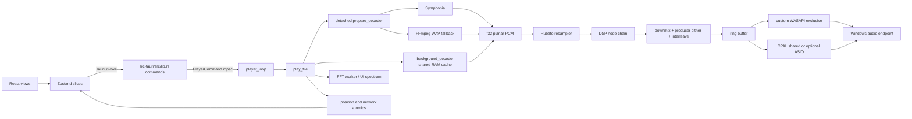

# Audio architecture and playback audit

**Snapshot:** `be94f376930cadd288b987183ee3486c6d36abbd`  
**Verdict:** **NO-GO**  
**Method:** code-review graph, source/data-flow inspection, default build/tests, exact dependency source inspection. No physical audio was played or captured.

## Actual architecture

The frontend/backend boundary is correctly IPC-only. The problem is not a forbidden direct import; it is that the backend reports preference flags as though they were verified active signal-path properties.

## Playback sequence

1. `librarySlice.playTrack` resolves Tidal/Qobuz URLs where applicable, then calls `play_track` (`src/store/librarySlice.ts:475-529`). Chromecast is a special branch; UPnP is not.
2. `lib.rs::play_track` sends `PlayerCommand::Play` (`src-tauri/src/lib.rs:2282`).
3. `player_loop` drains queued commands, chooses a play request, marks status/current track as playing, and calls `play_file` (`player/mod.rs:2138-2240`).
4. `play_file` starts a detached decoder-preparation thread and polls the shared command receiver (`player/mod.rs:3576-3714`).
5. `prepare_decoder` chooses native Symphonia or FFmpeg fallback. DSF/DFF deliberately take the FFmpeg/PCM path (`player/mod.rs:1119-1129`, `1304-1312`).
6. Eligible local files start a background full decode into shared planar `Vec<Vec<f32>>`; large files bypass it (`player/mod.rs:3820-3905`).
7. Output configuration is selected, then either custom WASAPI exclusive or CPAL is opened. All paths consume `f32` from a ring buffer (`player/mod.rs:4015-4719`).
8. The pump reads cache/demux packets, resamples, applies DSP, downmixes, optionally dithers, interleaves and pushes (`player/mod.rs:5009-5440`).
9. Commit `be94f37` may return an `ActiveStreamSession` to the next `play_file` call instead of dropping the device stream (`player/mod.rs:5454-5518`).

## Architecture findings

### AUD-AUD-01 — “Bit-perfect” is not a byte-transparent path

**Severity:** P0  
**Evidence:** STATIC-HIGH

- Every decoded path becomes floating-point planar samples and later gets re-quantized for integer hardware. The source bytes and source valid-bit width are not preserved.
- The direct internal bypass is only `bit_perfect && file_rate == dev_rate && file_ch == dev_ch` (`player/mod.rs:5135-5139`). If rates differ, the code resamples but still bypasses DSP based on the raw bit-perfect preference (`player/mod.rs:5237`).
- `bit_perfect` and `exclusive_mode` are independent atomics (`lib.rs:1831-1863`). Bit-perfect can therefore be displayed while output remains shared or resampled.
- Output configuration tries formats according to device support, not the source's coded word length (`player/mod.rs:81-175`).
- Shared and exclusive callbacks begin from zero gain and ramp over 256 frames; the exclusive ring is also prefilled with silence (`player/mod.rs:4100-4105`, callback sections around `4252-4292`; `wasapi_engine.rs:404-419`). Those frames cannot be identical to the source.
- `get_playback_status` reports the preference flags and derives `driver_type` from the selected device-name prefix, not a verified active backend (`lib.rs:2556-2586`).

The UI nevertheless says `BIT-PERFECT DIRECT`, `ASIO / BIT-PERFECT`, and device-specific bit-perfect text (`AudioControlCenter.tsx:117-119,314`; `PlayerBar.tsx:611`; `FullscreenView.tsx:294-296`). Those are unsupported assertions.

**Required truth condition:** define “bit-perfect” narrowly, expose actual active host/share mode/sample format/rate/channels and whether every mutating stage was bypassed, then verify with deterministic digital loopback/null comparison. Until then use wording such as “DSP bypass requested.”

### AUD-AUD-02 — DSF/DFF are PCM, not native DSD or DoP

**Severity:** P0  
**Evidence:** STATIC-HIGH

`transcode_codec_and_rate` maps DSD to PCM: 24-bit/176.4 kHz for the highest tier, 24-bit/88.2 kHz for studio, or 16-bit/44.1 kHz for standard (`player/mod.rs:1119-1129`). The decoder detects `.dsf`/`.dff` and routes them through FFmpeg (`player/mod.rs:1304-1312`). No code constructs native DSD packets or DoP marker frames.

The UI unconditionally returns `DSD NATIVE` from the track format string (`FullscreenView.tsx:287-293`). This is false for the audited implementation. The project's own unit test confirms resampling: `test_native_tier_resamples_dsd` expects 176400 Hz (`player/mod.rs:5589-5592`).

The DoP open standard describes DSD64 packing into 24-bit PCM frames with marker bytes and a 176.4 kHz frame rate; this implementation produces ordinary PCM samples instead ([DoP open standard 1.1](https://dsd-guide.com/sites/default/files/white-papers/DoP_openStandard_1v1.pdf)).

### AUD-AUD-03 — FFmpeg fallback silently collapses channel layout

**Severity:** P1  
**Evidence:** STATIC-HIGH

The main fallback produces WAV PCM with `-ac 2`; background fallback also hardcodes `pcm_s16le`, 44.1 kHz, stereo (`player/mod.rs:3357-3364`). Consequently DSD, unsupported local codecs and many streams lose multichannel information before the DSP graph.

This is not disclosed in playback status. `file_ch` can describe metadata obtained on a different decoder path rather than the FFmpeg output actually cached.

### AUD-AUD-04 — Background fallback metadata can disagree with cached audio

**Severity:** P0  
**Evidence:** STATIC-HIGH

The primary decoder publishes its `file_rate`/`file_ch`, while a failed native background decode launches FFmpeg fixed at 44.1 kHz/stereo. The cache object retains the primary rate/channel fields (`player/mod.rs:3357-3364`, `3864-3873`). Playback indexes and resamples that cache using the primary metadata.

For a DSD track whose main path advertises 176.4 kHz but whose background cache contains 44.1 kHz PCM, cached samples can be consumed as though they were 176.4 kHz: a four-times speed/pitch error is the direct arithmetic consequence. For an unsupported multichannel file, background extraction can also ask a stereo decoded buffer for original channels. These exact fixtures are missing from the test suite, so the finding is STATIC-HIGH rather than REPRODUCED.

### AUD-AUD-05 — RAM safety is based on compressed bytes/duration, not decoded allocation

**Severity:** P1  
**Evidence:** STATIC-RISK

The cache accepts local files up to 150 MiB and 900 seconds (`player/mod.rs:3820-3844`) then stores every decoded sample as `f32` per channel. Approximate decoded bytes are:

`duration_seconds × sample_rate × channels × 4`.

A 899-second, 384 kHz, eight-channel file is about 11.0 GB of sample storage even if its compressed file is below 150 MiB. There is no decoded-byte budget or backpressure eviction.

### AUD-AUD-06 — Downmix is incomplete and layout-blind

**Severity:** P1  
**Evidence:** STATIC-HIGH

The `>= 6` stereo fold-down uses indices 0, 1, 2, 4 and 5, ignoring LFE and any channels above index 5 (`player/mod.rs:5246-5257`). The generic branch assigns channels by even/odd index rather than an actual channel mask (`5258-5273`). A 7.1 source loses rear channels; a 3.0 centre is routed by index parity instead of a defined matrix.

### AUD-AUD-07 — Playback status becomes “Playing” before decode/output readiness

**Severity:** P1  
**Evidence:** STATIC-HIGH

`player_loop` sets status, current path and position before `prepare_decoder` returns or a stream starts (`player/mod.rs:2215-2227`). The frontend can therefore show the new track as playing while the old ring drains, the decoder is blocked, or output initialization later fails. Commit `be94f37` makes this more visible because an old stream may remain alive across that interval.

### AUD-AUD-08 — The new session handoff is a stream-reuse optimization, not proven “true gapless”

**Severity:** P0  
**Evidence:** STATIC-HIGH

`can_reuse_stream_session` checks device, exclusive flag and (only for exclusive) rate. It stores but does not compare channel count; it does not compare bit-perfect state, sample format/valid bits, dither policy, or desired output channel configuration (`player/mod.rs:3517-3556`). Shared-mode sessions are accepted for any next source rate.

For a normal non-crossfaded queue transition, the next decoder is prepared only after the current `play_file` returns. The old ring may hide some preparation latency, but if decode takes longer the callback emits silence. No automated test measures the transition or asserts zero inserted/dropped/duplicated frames. Detailed race and old-audio findings are in `02_AUDIO_CONCURRENCY_AND_GAPLESS.md`.

## Test-evidence quality

The graph at this commit contains 2,400 indexed nodes after the gapless update. Its `tests_for` query connects `play_file`, `player_loop` and decoder functions to many tests, but the returned examples are indirect DSP/lyrics tests. That graph connectivity is not end-to-end playback coverage.

The new tests prove only:

- a pure session-reuse predicate for the cases chosen by the author; and
- a pure vector trim helper.

They do not open a stream, exercise the command receiver, preserve a ring across a real transition, wait for a decoder, test different channel/sample formats, inspect cursor movement, or compare output samples.

## Minimum acceptance suite

1. Deterministic decoder fixtures for PCM16/24/32, float, MP3/AAC delay+padding, FLAC, 5.1/7.1, DSF and DFF.
2. An injectable fake output sink that records every interleaved frame across play, seek, skip, pause, queue advance and failure.
3. Exact assertions for no old-track frames after manual play, and no missing/duplicated frames for compatible gapless albums.
4. Separate acceptance tests for incompatible rate/channel/format transitions with honest expected behavior.
5. A source-vs-output digital comparison for the narrowly supported bit-perfect matrix.
6. Physical WASAPI/ASIO/DSD verification from `04_HARDWARE_WASAPI_ASIO_DSD.md` before product labels are restored.

